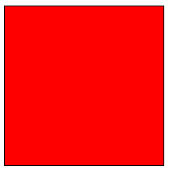

# scss-graph

図形描画で SCSS の練習

## Environment

- OS:
    - Ubuntu 18.04
    - Windows 10
- Node.js: 12.14.1
    - Yarn package manager: 1.21.1

### Setup
```bash
# create package.json
$ yarn init -y

# install webpack関連パッケージ
$ yarn add  webpack webpack-cli webpack-dev-server \
            babel-loader @babel/core @babel/preset-env babel-polyfill \
            css-loader style-loader url-loader node-sass sass-loader \
            mini-css-extract-plugin optimize-css-assets-webpack-plugin \
            copy-webpack-plugin imagemin-webpack-plugin

# install react
$ yarn add  react react-dom @babel/preset-react
```

### Structure
```bash
./
|_ dist/ # コンパイル済み css, js, img 格納ディレクトリ
|   |_ img/
|   |_ css/
|   |   |_ (style.css) # webpackコンパイル後 css
|   |
|   |_ js/
|   |   |_ (app.js)    # webpackコンパイル後 js
|   |
|   |_ index.html # webpack-dev-server root: http://localhost:3000
|
|_ src/  # ソース scss, js, img 格納ディレクトリ
|   |_ img/
|   |_ js/
|   |   |_ app.jsx    # webpackソース js
|   |
|   |_ scss/
|       |_ style.scss # webpackソース scss
|
|_ package.json       # パッケージ設定等
|_ webpack.config.js  # webpack設定
```

#### webpack.config.js
```javascript
const path = require('path');
const CopyWebpackPlugin = require('copy-webpack-plugin');
const MiniCssExtractPlugin = require('mini-css-extract-plugin');
const OptimizeCSSAssetsPlugin = require('optimize-css-assets-webpack-plugin');
const ImageminPlugin = require('imagemin-webpack-plugin').default;

module.exports = [
  {
    // ソースファイル: app.jsx, style.scss
    entry: {
      app: [
        './src/js/app.jsx',
        './src/scss/style.scss',
      ],
    },
    // コンパイル先
    output: {
      path: path.resolve(__dirname, 'dist'), // 絶対パス指定
      filename: 'js/[name].js',
      publicPath: '/',
    },
    // webpack-dev-server: http://localhost:3000 => ./dist/
    devServer: {
      contentBase: './dist',
      watchContentBase: true,
      port: 3000,
      open: true, // 自動的にブラウザ起動
    },
    // コンパイル設定
    module: {
      rules: [
        {
          // *.js, *.jsx => babel-loader でコンパイル
          test: /\.jsx?$/,
          exclude: /node_modules/, // node_modules を除外
          use: [
            {
              loader: 'babel-loader',
              options: {
                // @babel/preset-env, @babel/preset-react 構文拡張
                presets: ['@babel/preset-env', '@babel/preset-react']
              }
            }
          ]
        },
        {
          // *.scss => sass-loader |> css-loader |> MiniCssExtractPlugin の順でコンパイル
          test: /\.scss$/,
          use: [{
            loader: MiniCssExtractPlugin.loader,
          }, {
            loader: 'css-loader',
          }, {
            loader: 'sass-loader',
          }],
        },
        {
          // 画像系 => url-loader でコンパイル
          test: /\.(jpe?g|png|gif|woff|woff2|eot|ttf|svg)(\?[a-z0-9=.]+)?$/,
          use: [
            {
              loader: 'url-loader?limit=100000&name=img/[name].[ext]',
            },
          ],
        },
      ],
    },
    // 最適化設定
    optimization: {
      minimizer: [
        new OptimizeCSSAssetsPlugin(),
      ],
    },
    // *.js, *.jsx を require 可能に
    resolve: {
      extensions: ['.js', '.jsx'],
    },
    // プラグイン設定
    plugins: [
      new CopyWebpackPlugin([
        {
          from: path.resolve(__dirname, 'src/img/'),
          to: path.resolve(__dirname, 'dist/img/'),
        },
      ]),
      new MiniCssExtractPlugin({
        filename: 'css/style.css',
      }),
      new ImageminPlugin({
        test: /\.(jpe?g|png|gif|svg)$/i,
        pngquant: {
          quality: '95-100',
        },
      }),
    ],
  },
];
```

#### package.json
- npm scripts
    - `start`: webpack-dev-server（開発サーバ）実行
    - `dev`: 開発用に webpack でコンパイル実行
    - `prod`: 本番用に webpack でコンパイル実行

```diff
  {
    ...
+   "scripts": {
+     "start": "webpack-dev-server",
+     "dev": "webpack --mode development",
+     "prod": "webpack --mode production"
+   }
  }
```

#### dist/index.html
```html
<!DOCTYPE html>
<html>
<head>
    <meta charset="UTF-8">
    <meta name="viewport" content="width=device-width, initial-scale=1.0">
    <title>SCSS図形</title>
    <!-- Webpack でコンパイルした style.css 読み込み -->
    <link rel="stylesheet" href="./css/style.css">
</head>
<body>
    <div id="app"></div>
    <!-- Webpack でコンパイルした app.js 読み込み -->
    <script src="./js/app.js"></script>
</body>
</html>
```

---

### 動作確認



#### src/scss/style.scss
```scss
.sample1 {
    width: 200px;
    height: 200px;
    border: solid 1px #000;
    background-color: #f00;
}
```

#### src/js/app.jsx
```jsx
import React from 'react';
import {render} from 'react-dom';

class App extends React.Component {
  render () {
    return <div class="sample1"></div>;
  }
}

// '#app' => render React.Component/App
render(<App/>, document.getElementById('app'));
```
