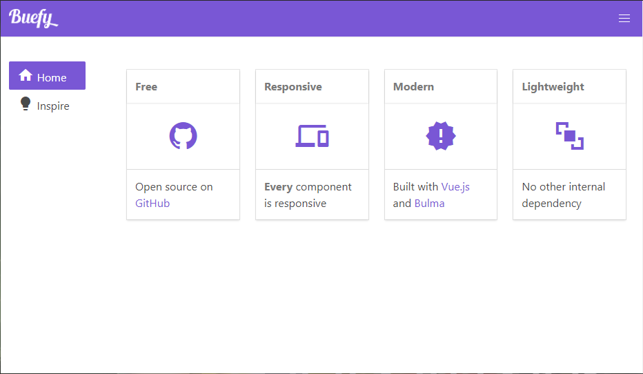
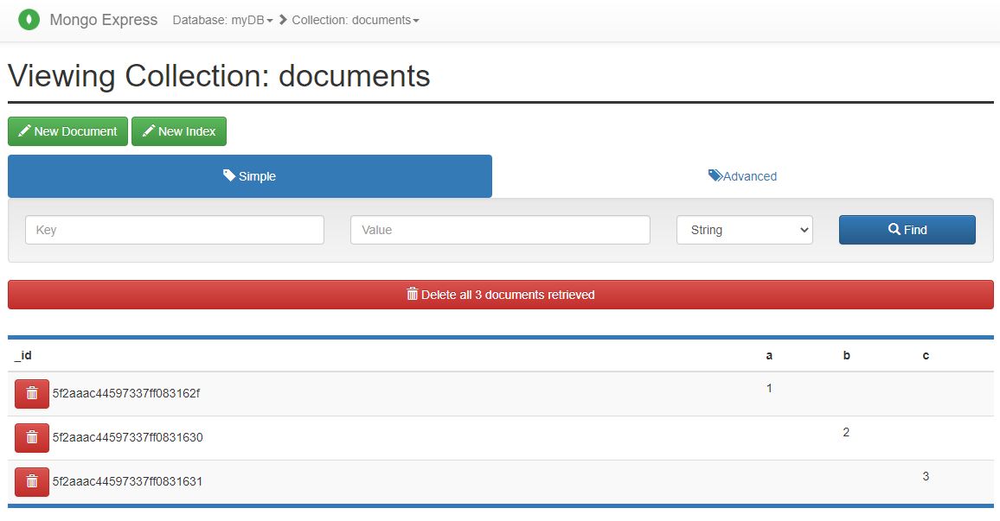
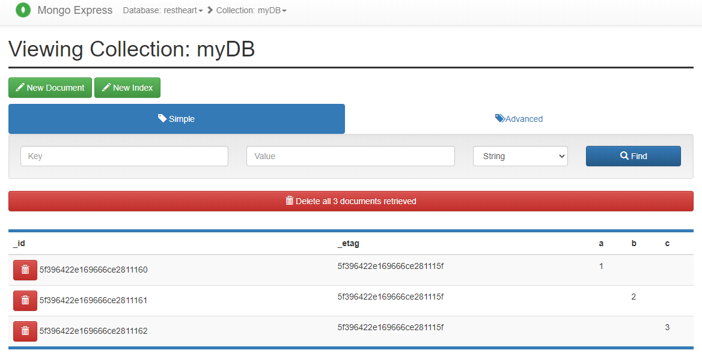
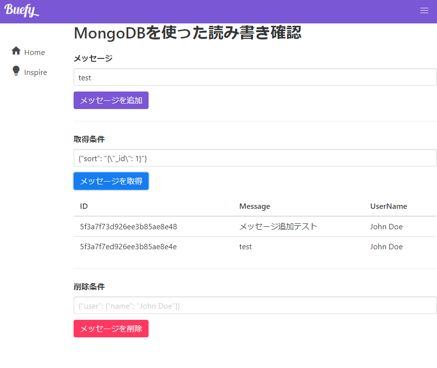
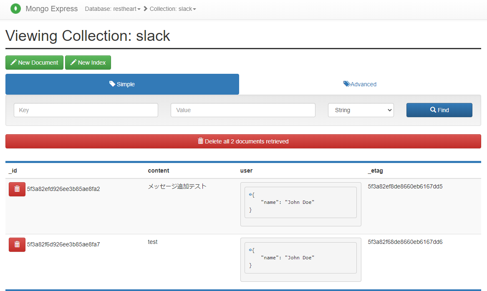

# nuxt-app

Nuxt.js アプリ開発練習

## Environment

- OS:
    - Ubuntu 20.04
- Docker: 19.03.12
    - docker-compose: 1.26.0

### Setup
```bash
# add execution permission to ./n
$ chmod +x ./n

# setup and start docker containers
## node command: service://cli in localhost network
## mongodb server: service://db:27017 => http://localhost:27017
## mongodb express server: service://admin:8081 => http://localhost:8081
## mongodb rest api server: service://restheart:8080 => http://localhost:8080
$ export UID && docker-compose build
$ docker-compose up -d

# create nuxt project => ./nuxt/
## $ docker-compose run node npx create-nuxt-app nuxt
$ ./n npx create-nuxt-app nuxt
## Project name: slack-clone
## Programming language: JavaScript
## Package manager: Yarn
## UI framework: Buefy
## Nuxt.js modules: Axios
## Linting tools: ESLint
## Testing framework: None
## Rendering mode: Universal (SSR / SSG)
## Deployment target: Server (Node.js hosting)
## Development tools: jsconfig.json

# start nodejs server
## $ docker-compose exec -w /work/nuxt/ cli yarn dev
$ opt='-w /work/nuxt/' ./n yarn dev

# => Listening on: http://localhost:3000 => service://node:3000
```



***

## Tests

### MongoDB from Node.js
```bash
# install node_packages: mongodb
$ opt='-w /work/tests/' ./n yarn add mongodb

# execute node ./tests/mongodb.js
$ opt='-w /work/tests/' ./n node mongodb.js

connected
Inserted 3 documents into the collection
{
  result: { ok: 1, n: 3 },
  ops: [
    { a: 1, _id: 5f2add9fd472a97a35c46942 },
    { b: 2, _id: 5f2add9fd472a95424c46943 },
    { c: 3, _id: 5f2add9fd472a97e8ec46944 }
  ],
  insertedCount: 3,
  insertedIds: {
    '0': 5f2add9fd472a97a35c46942,
    '1': 5f2add9fd472a95424c46943,
    '2': 5f2add9fd472a97e8ec46944
  }
}
```

http://localhost:8081/db/myDB/documents



### Control MongoDB through Rest API Server
```bash
# install node_packages: axios
$ opt='-w /work/tests/' ./n yarn add axios

# execute node ./tests/mongodb.js
$ opt='-w /work/tests/' ./n node restheart.js

{
  inserted: 3,
  links: [
    '/myDB/5f396422e169666ce2811160',
    '/myDB/5f396422e169666ce2811161',
    '/myDB/5f396422e169666ce2811162'
  ],
  deleted: 0,
  modified: 0,
  matched: 0
}
[
  {
    _id: { '$oid': '5f396422e169666ce2811160' },
    _etag: { '$oid': '5f396422e169666ce281115f' },
    a: 1
  },
  {
    _id: { '$oid': '5f396422e169666ce2811161' },
    _etag: { '$oid': '5f396422e169666ce281115f' },
    b: 2
  },
  {
    _id: { '$oid': '5f396422e169666ce2811162' },
    _etag: { '$oid': '5f396422e169666ce281115f' },
    c: 3
  }
]
```

RestHeart を使った場合、コレクション（データベース名）は restheart になる

http://localhost:8081/db/restheart/myDB/



***

## Nuxt.js

### MongoDB読み書き動作確認

#### Plugin実装
[plugins/mongodb.js](./nuxt/plugins/mongodb.js)

#### nuxt.config.js
```diff
  // ...

  plugins: [
+   {src: '~/plugins/mongodb.js'}
  ],

  // ...
```

#### pages/tests/mongodb.vue
```vue
<template>
  <div>
    <h1 class="title">MongoDBを使った読み書き確認</h1>
    <form @submit.prevent="addMessage">
      <b-field label="メッセージ">
        <b-input v-model="message" />
      </b-field>
      <b-field>
        <button type="submit" class="button is-primary">メッセージを追加</button>
      </b-field>
    </form>
    <hr>
    <form @submit.prevent="readMessage">
      <b-field label="取得条件">
        <b-input v-model="readCondition" placeholder='{"sort": "{\"_id\": 1}"}' />
      </b-field>
      <b-field>
        <button type="submit" class="button is-info">メッセージを取得</button>
      </b-field>
      <b-table :data="messages" :columns="columns"></b-table>
    </form>
    <hr>
    <form @submit.prevent="dropMessage">
      <b-field label="削除条件">
        <b-input v-model="dropCondition" placeholder='{"user": {"name": "John Doe"}}' />
      </b-field>
      <b-field>
        <button type="submit" class="button is-danger">メッセージを削除</button>
      </b-field>
    </form>
  </div>
</template>

<script>
export default {
  name: 'Home',
  data() {
    return {
      message:'',
      readCondition: '',
      messages: [],
      columns: [
        {field: 'id', label: 'ID'},
        {field: 'message', label: 'Message'},
        {field: 'user_name', label: 'UserName'},
      ],
      dropCondition: '',
    };
  },
  mounted() {
    // MongoDB REST API Server 接続
    this.$initializeMongoDB({
      user: 'admin',
      password: 'secret',
      url: 'http://localhost:8080',
    })
  },
  methods: {
    /**
     * メッセージ追加
     */
    async addMessage() {
      const res = await this.$mongodb().ref('slack')
        .push({
          content: this.message,
          user: {
            name: 'John Doe'
          }
        })
      this.$buefy.snackbar.open('メッセージが追加されました')
    },

    /**
     * メッセージ取得
     */
    async readMessage() {
      const res = await this.$mongodb().ref('slack')
        .get(this.readCondition? JSON.parse(this.readCondition): {})
      this.messages = []
      for (const data of res.data) {
        this.messages.push({
          'id': data['_id']['$oid'],
          'message': data.content,
          'user_name': data.user.name,
        })
      }
    },

    /**
     * メッセージ削除
     */
    async dropMessage() {
      const res = this.dropCondition?
        await this.$mongodb().ref('slack').drop(JSON.parse(this.dropCondition))
        : await this.$mongodb().ref('slack').dropAll()
      this.$buefy.snackbar.open('メッセージを削除しました')
    }
  },
};
</script>
```

#### 動作確認
```bash
# launch nuxt development server
$ opt='-w /work/nuxt' ./n yarn dev
```

http://localhost:3000 で MongoDB データベースの読み書きができるか確認

RestHeart の API については https://restheart.org/docs/quick-reference/ 参照



#### Mongo Express でデータベース確認
http://localhost:8081/db/restheart/slack


